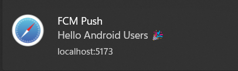
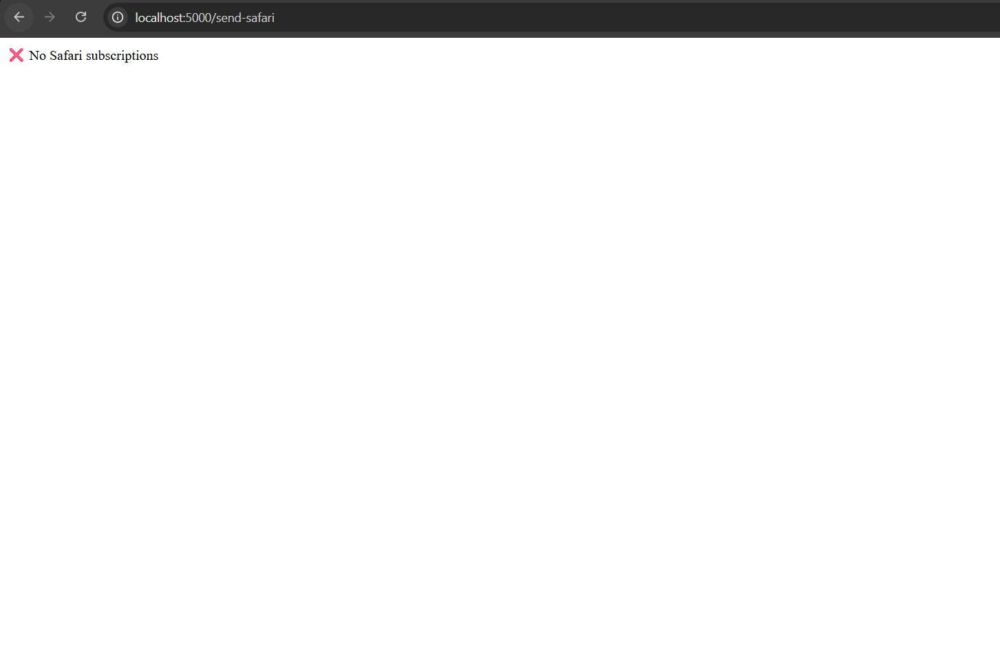
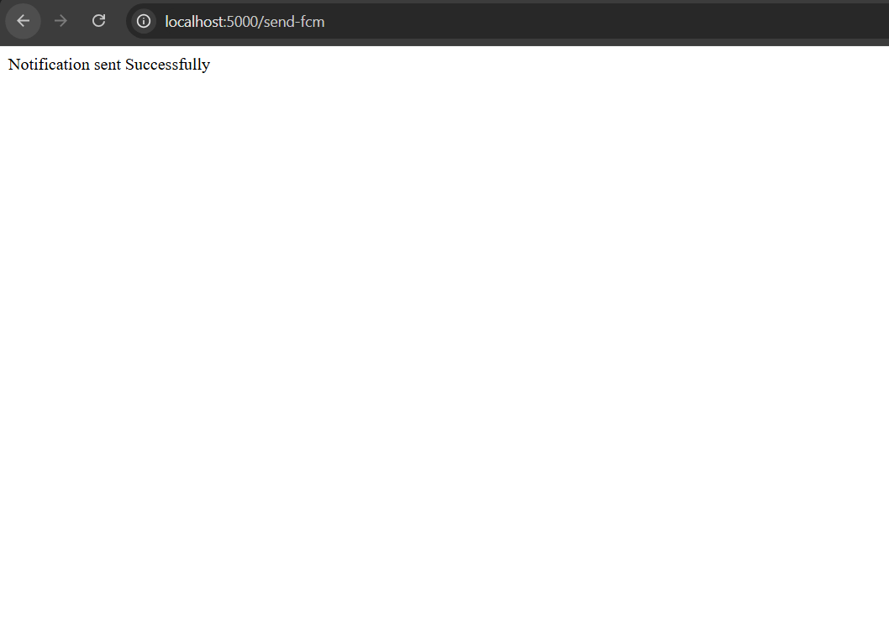

# 🌍 Universal Push Notification System (FCM + Safari Web Push)

This project implements a unified push notification system that works across:

 - Chrome / Android / Firefox — using Firebase Cloud Messaging (FCM)

 - Safari on iOS (16.4+) PWAs — using Web Push with VAPID keys
 
## 🚀 Architecture Overview

### 1. Frontend (React + Service Workers)

* Requests notification permission from the user.

* Distinguishes between Safari and other browsers.

* Manages both FCM token registration & Safari push subscription.

* Uses service workers to handle background and foreground notifications.

### 2. Backend (Express + Firebase Admin + Web Push)

* Stores FCM tokens and Safari push subscriptions.

* Sends notifications with:

* admin.messaging().send() → for FCM devices.

* web-push.sendNotification() → for Safari subscribers.

### 3. Service Workers

* firebase-messaging-sw.js → Handles Android/Chrome/Firefox pushes.

* safari-sw.js → Handles Safari push events.

# 📂 Project Folder Structure – Universal Push Notifications


---

## 📝 Notes

- **backend/**  
  - Contains all Express APIs:  
    - `/save-token`  
    - `/save-subscription`  
    - `/send-fcm`  
    - `/send-safari`  
  - Uses:
    - `firebase-admin` for FCM
    - `web-push` for Safari Push

- **frontend/**  
  - React app with notification logic.
  - Detects browser type (Safari vs Chrome/Android/Firefox).
  - Registers the correct **service worker**:
    - `firebase-messaging-sw.js` → FCM  
    - `safari-sw.js` → Safari  

- **public/**  
  - Service workers must be at the **public root** in CRA/Vite, or else they won't register properly.  
  - Notification icons should also be placed here.

---


## 🖥️ Browser Flow

### ✅ Chrome / Firefox / Android (via FCM)

1. Permission Request
- Ask the user for push permission with Notification.requestPermission().

2. Get FCM Token
````
const fcmToken = await getToken(messaging, {
  vapidKey: "YOUR_FIREBASE_VAPID_KEY",
});
````
3. Save Token to Backend

- Send to backend POST /save-token

- Backend saves it in memory (Set) for demo purposes.

4. Send Notification (Backend)

```
const message = {
  data: {
    title: "FCM Push",
    body: "Hello Android Users 🎉",
  },
  token,
};
await admin.messaging().send(message);
```
5. Background Notifications (firebase-messaging-sw.js)
```
messaging.onBackgroundMessage((payload) => {
  self.registration.showNotification(payload.data.title, {
    body: payload.data.body,
    icon: "/logo192.png",
  });
});
````
6. Foreground Notifications (App.jsx)
````
onMessage(messaging, (payload) => {
  new Notification(payload.data.title, {
    body: payload.data.body,
    icon: "/logo.png",
  });
});
````
### ✅ Safari (iOS 16.4+ PWAs)

Since Safari does not use FCM, it uses Web Push API with VAPID keys.

1. Permission Request
```
const permission = await Notification.requestPermission();
```
2. Generate Push Subscription
```
let subscription = await registration.pushManager.subscribe({
  userVisibleOnly: true,
  applicationServerKey: urlBase64ToUint8Array(VAPID_PUBLIC_KEY),
});
```
3. Save Subscription to Backend  
Send to:
```
POST /save-subscription
```
4.Send Notification (Backend)
```
const payload = JSON.stringify({
  title: "Safari Push 🎉",
  body: "Hello from iOS Web Push",
});
await webpush.sendNotification(subscription, payload);
```
5. Receive Push (Service Worker: safari-sw.js)
````
self.addEventListener("push", (event) => {
  const data = event.data.json();
  event.waitUntil(
    self.registration.showNotification(data.title || "Safari Push", {
      body: data.body || "No body",
      icon: "/logo.png",
    })
  );
});
````
### ⚙️ Key Components
🔹 Backend APIs
- POST /save-token → Save FCM token

- POST /save-subscription → Save Safari Web Push subscription

- GET /send-fcm → Trigger FCM push

 - GET /send-safari → Trigger Safari push

🔹 Service Worker Registration

````
export function register() {
  const swFile = isSafari ? "/safari-sw.js" : "/firebase-messaging-sw.js";
  navigator.serviceWorker.register(swFile);
}
````

---

## 📊 Comparison: FCM vs Safari Push

| Feature         | Chrome/Android/Firefox (FCM) | Safari iOS (Web Push)   |  
|-----------------|-----------------------------|-------------------------|    
| Token Type      |  **String (FCM token)**      | **PushSubscription object** |    
| Backend Send    | `admin.messaging().send()`  | `webpush.sendNotification()` |   
| Service Worker  | `firebase-messaging-sw.js`  | `safari-sw.js`          |    
| Permission Flow | Standard FCM                | Web Push + VAPID        |   

---

## ✅ Conclusion

- Implementation is **correct** ✔  
- Flows are properly separated for **FCM** & **Safari**.  
- Both **background** and **foreground** notification handling works.  
- Backend uses proper APIs.  

---


### Output Images







